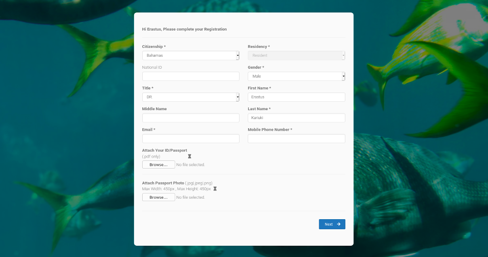
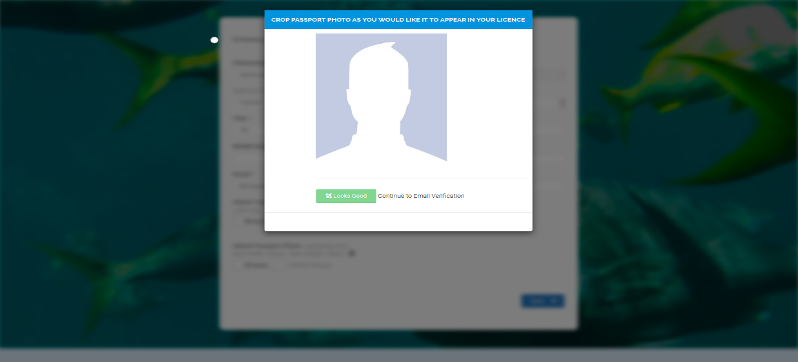

# Registering Your User Profile and Logging in {-}

### ORCID ID

Applicants will need to use a free ORCID ID to create a profile. ORCID stands for Open Researcher and Contributor ID. ORCID’s mission is to enable transparent and trustworthy connections between researchers, their contributions, and their affiliations by providing a unique, persistent identifier for researchers to use free of charge - as they engage in research, scholarship, and innovation. 

If you already have an ORCID ID please use that. Please do not create a second one. 

If you do not have an ORCID ID you can set one up [here](https://orcid.org/). An ORCID profile is under the control of the researcher themselves and they retain the capacity to make information public or private. 

ORCID ids distinguish researchers from others who might have the same or similar names. They also keep researchers connected to their work, regardless of name changes or changes to organizational affiliation. These ids link researchers and their scholarly activities - like published articles or dissertations, patents, artistic performances and datasets. The advantage of ORCID ids for researchers are that they allow information on their employment, research funding and publications to be stored in one place. In particular, the publication profile can be automatically updated through services such as [Crossref](https://www.crossref.org/). This makes it easier for us to create an electronic archive of research publications about the Bahamas and reduces the need to send emails asking for copies of publications. 

When you have logged in for the first time using ORCID you will need to fill out a user profile.

## User Profile

This section covers the steps necessary to register your user profile with the Bahamas Research and Access and Benefit-Sharing Permit System. When registering you will create a free username and password with your email address. You will register your profile using the registration page below:

To complete the registration you will need the following documents:

### A Photocopy of Your Passport

This should be your current passport and it should be in pdf format. Your passport is required as part of the registration process and will be needed to create your account.
<!-- does the passport need to have a set amount of time before expiry? -->

__IMPORTANT: Please note that if you take a photo of your passport with your smart phone the file size will need to be reduced__ (a modern smartphone with a high resolution will produce a file of upto 80MB). Instructions on how to do this are available for Mac [here](https://support.apple.com/en-gb/guide/preview/prvw2015/mac) and for Windows 10 you will find instructions [here](https://support.microsoft.com/en-us/topic/compress-a-picture-4598c336-688b-4ade-a582-ef966a978ffd). Please note that we will not do this for you. 

### Passport Sized Photo

You are required to provide a passport photo as part of the registration process. The standard passport photo size for the Bahamas is the same as in the United States and European Union countries (sizes below). You will be able to upload, recentre and crop the photo using our photo crop functionality. 

__Electronic image requirements__

- The format should be jpeg or png
- Minimum size 600 pixels by 600 pixels, maximum size 1200 by 1200 pixels. 
- The image must be in colour (24 bits per pixel) in sRGB colour space. 

__Scanning an existing image__

If you are scanning an existing image the photo itself must be:

- 51mm x 51mm (2 x 2 inches)
- Scanned at a resolution of 300 pixels per inches (or 12 pixels per millimetre)

Upon successful registration with the ABS permit system, a verification code window will open and you will have to enter a code sent to the email address you have provided. Once you have done this successfully, you will be taken to the ABS permit application form.

## Logging in

Once you have registered your profile, you can log in through the Bahamas Reasearch and Permitting Home page. You can log in using your ORCID id.

__IMPORTANT__: If logging in with an email address ensure that you __use the same email address you used to register with ORCID__ or the system will not allow you to upload documents and complete an application. If a principal investigator has added you to the system as a support team member use the same email to register for ORCID if you do not already have an ORCID. If you already have an ORCID ask the principal investigator to edit the application to use your ORCID email address.   

## Your Home Page

When you have logged into the system you will be taken to your home page. From here you will be able to create new applications, retrieve the details of existing applications and review invoices for application fees. 

## Communications with Desk Officers

The desk officers at permit granting authorities may need to contact you with questions relating to your application. This is handled through emails generated by the system. These communications are automatically stored as part of the file history of the application. 

