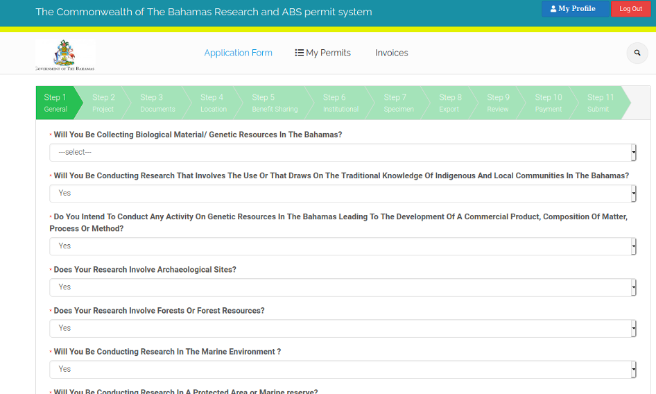

# General

At the beginning of the application you will answer a set of trigger questions. This section helps the system to determine what permits you will need for your proposed project. It is composed of simple 'yes/no' questions. An answer is required to each question in order to determine which permits you are likely to need and as a result, which parts of the form you should answer. 

All research activities in the Bahamas require a permit and must apply through the online research and permit system. If you do not see a category that applies to you answer NO to the relevant questions, fill out the application form and submit. Desk officers will assist you with the remainder of the process. 

In a small number of cases you may need a specialised permit that is not included in the online system. You can find these and links to the forms in the [Permits and Licences](https://www.bahamas.gov.bs/wps/portal/public/Permits%20and%20Licences/!ut/p/b1/vVTJcptAEP0Wf0DMDDAsR_adQSyS4KICYRCbBEIbfH1wkoOdqtiX2DOnqXndr_v1QiTElkiO6a0q00t1Oqbt6zthdhTQHEGgOUdDgAFG5NmCx-okhmgBxB8AaPDbXsO0oyzfWJUEYECF1qmVTIEAEBtiG8YTL43GXVWSoo9u2l5z0lCE6mBcqxJc2UBHV7KskB1R9x8rMj_aaMaeLEoWrsc-TsQqu9Y7xG_SslSDpKJi8g66m4bOPTcwG37nOeHl4dtZOSN0iPNm9BzRDTMYzSdn_2LmR8-_M2I2ZPOoy_tBtBgJXh6xp6tnVtVT_iQZQmtTuOCEK5VtXeHp6U_e4B9HAJ_pZhJJlXXP9333DJ4hBVlIQpZmWZZHCDKLLMmHHizyE8Cr8r8AH4QYLwD2jYdwDZbiAMEP4ApwLiRCYgvoXVBPvTE3s1_PK8qtTdPJTAM2AATRLXSjZnb53A2VAUIFWqFszEFtkKECXTeXvXztR6IgT7BS478JMRnyC6EEGStCSzPQX02oIcwtGrGhJyASaBh-NyH1rZJqHgZfnuG7pqFX_7-G7yaF4xmIWI7mOQbQNMcS6zpmeHnZHorhFv3-6vKyNRuBH1edWFoqXHUHZPXevcfJeeIbv403Ysl1OTvaut6RKd48hDKouou2Js9liR8Yj3Nl1pKoWYHtNWspXlnHsZnlahxrmTTArr1TFD8pVjJwbdgPQ4MO54a5zFlRWHoj41z7MRz7WrJug8EeCpKz6rAdgtsay0bXnovT_rxWffPaTHKrTdSh3kluvdMag12iorKhndJy2TCufupeiL6LbjYylcJ9e-mnn3zSVbg!/dl4/d5/L2dBISEvZ0FBIS9nQSEh/#) section of the Government website.

The following is a breakdown of each trigger question at the start of the application form, including the rationale. 

## Will You Be Collecting Biological Material/Genetic Resources In The Bahamas?

Biological material refers to any specimen taken from a biological organism of any kingdom, including animals, plants, fungi, bacteria, chromists and archaea. Genetic resources refers to biological material of actual or potential value. To collect these materials means to remove them from their place of origin, it does not refer to the study of biological material previously obtained by other parties. There is a distinction between the collection and the export of biological materials (See question 1.9)

## Will You Be Conducting Research That Involves The Use of Or Draws On The Traditional Knowledge Of Indigenous Peoples And Local Communities In The Bahamas?

In its working practice the Convention on Biological Diversity and its Nagoya Protocol use the term indigenous peoples and local communities. If you will be conducting research that involves communities in the Bahamas you need to answer yes to the above question. 

Bahamian communities have a rich and diverse cultural heritage that deserves to be recognised, valued, protected and promoted. Traditional knowledge refers to knowledge, innovations and practices that are passed down and adapted and developed across generations to form part of the living traditions and heritage of the communities of the Bahamas.

If you intend to conduct research that involves interviews, recordings, photography, film or engagement activities involving communities, families or individuals you should answer yes to the above question. You will be expected to conduct your research in a way that fully respects the human rights of community members and in accordance with professional ethical standards. If you are unsure about this you should seek guidance. 

If your research will involve filming activity you will need to apply for a permit from the Bahamas Film and Television Commission in addition to the permits required for your research. You can apply for that permit [here](http://www.bahamasfilm.com/Resources/procedures.htm).

## Do You Intend To Conduct Any Activity On Genetic Resources In The Bahamas Leading To The Development Of A Commercial Product, Composition Of Matter, Process Or Method? 

This question relates to your intentions with any biological material or information you may collect in the Bahamas. Commercial products are products which are sold to the general public, or to industry. Compositions of matter, processes and methods are categories of things which can be patented. Compositions of matter relate to tangible compositions - where the patent is for a material thing. Compositions of process or method relate to a way to use a product or serious of steps to accomplish a result. You should answer yes to this question if you have any intention of using research on genetic resources in the Bahamas to develop and/or patent a product of any kind for commercial sale. If you wish to profit commercially from biological material or information obtained in the Bahamas, a contract (often called Mutually Agreed Terms or an ABS agreement) will need to be established with the Government of the Bahamas before research begins.

## Does Your Research Involve Archaeological Sites?

An archaeological site is any place where there are physical remains of past human activities. If you are doing research in an archaeological site, you will need a permit from the Antiquities Monuments & Museums Corporation. This permit is part of the system and will be autofilled as you complete this form. AMMC desk officers will contact you if they need further clarification on your proposed research. 

## Does Your Research Involve Forests Or Forest Resources?

The Department of Forestry does not currently issue permits but will do so in the future. As a result, this question is presently for informational purposes only. That situation is subject to change. 

## Will You Be Conducting Research In The Marine Environment?

Any research conducted in Marine Environments within and around the Bahamas must be sanctioned by the Department of Marine Resources. These permits form part of this system and will be autocompleted as you proceed through the system. 

## Will You Be Conducting Research In A Protected Area or Marine reserve?

In the Bahamas there are marine protected areas and forested protected areas. Permits will be needed to conduct research in any protected area managed by Bahamian public authorities. If your research will be conducted in any protected area or marine reserve managed by the state of the Bahamas you must select yes here.

## Will Your Research Involve The Use Of CITES Listed Resources?  

CITES stands for the Convention on International Trade in Endangered Species. It is a multilateral treaty to protect endangered plants and animals. Trade in species listed in CITES Appendix I, II or III are heavily regulated. More information can be found on the [CITES website](https://cites.org/). You must click yes if you seek to collect biological material from CITES listed species. You will not be able to collect specimens related to these species without a CITES permit.

## Will You Be Exporting Biological Material/Genetic Resources From The Bahamas?

Specify whether your research will involve the removal of biological samples from the Bahamas. This refers not only to physical samples, but also to genetic sequence data (also known as digital sequence information) that you may seek to extract and upload to a database or otherwise transport outside the jurisdiction of the Government of the Bahamas. The export of any genetic material from the Bahamas must be accompanied by an appropriate permit.