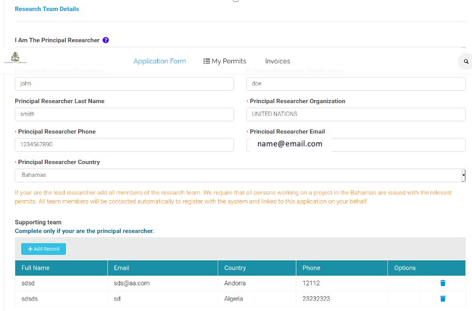
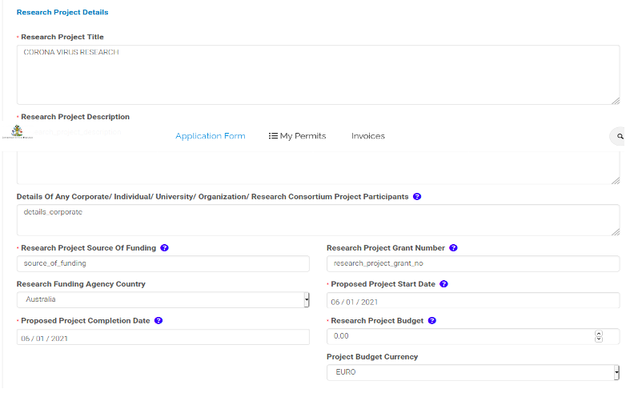

# Project Information

In this step you will provide information about your project including your research goals, sources of funding and the members of your research team.

## You Are Applying As

In this section, you define what type of applicant you are. In answering this question you have the option to apply as:

- A Company
- A Consortium (a consortium is a group of public or private entities)
- An Individual
- A Research Institution
- A Student

The application form is the same regardless of the category of applicant. Please choose the category that most accurately reflects your status. 

- If you are part of a consortium we will ask for details of the entities involved in the consortium. This includes all public and private entities.
- If you are a company planning to conduct commercial research on biodiversity and/or traditional knowledge the application requirements are the same but the contractual provisions in the access and benefit-sharing agreement will normally be tailored to your project. 

## Institution Details

**Name of the Institution** - The name formally used for your institution. 

**Institution Contact Person** - This is the legal officer (such as the contracts officer) who has authority to sign legally binding contracts on behalf of the institution. Unless you are that person you should not place your name here. Researchers are agents of their employers and do not normally possess legal authority to sign contracts on behalf of their institution. 

**Institution Legal Registration Number** - This is the number or identifier used on the registration certificate for your organisation (e.g. as used by Companies House or equivalent).

## Research Team Details

If you are the principal researcher or team leader you need to provide the name and contact details of each member of your research team. The individuals will then be invited to register on the system and answer the relevant questions. The individuals will then be associated with the issued permits. All team members must be named on the permit at the point when it is issued. This cannot be rectified later.

Where an individual team member is from a different institution, their legal officer will also be required to sign an contract (ABS agreement).

Note that **all members of the research team must be named individuals** or processing of the application will be delayed for clarification.

## Research Project Details

**Research Project Description** This is a short abstract describing the project. It should be written in a form that is suitable for the general public to read.

**-Research Project Source of Funding** Please give the full name of the research funding organisation or other source of funding.

**Proposed Project Start Date**. This is the formal start date of the research project. It is not the start date of your proposed research in the Bahamas.

**Proposed Project Completion Date** This is the formal end date of the research project. It is not your proposed date of departure from the Bahamas.

**Research Project Grant Number**. This is the unique identifier awarded to your research grant when awarded by the funding agency. If you are presently at the application stage please use the application number.

If you have previously received a permit for research in the Bahamas please provide the number of the most recent permit that you received.

## Equipment

These questions only apply in circumstances where you are seeking to make _duty-free imports of equipment_. The term equipment does not apply to expendable supplies (food, fuels or other consumable materials etc.)
