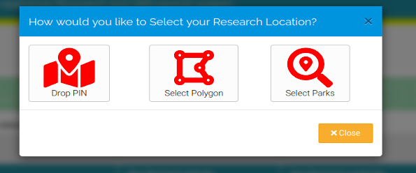

# Location

In this section you must provide location information for each site where research will be undertaken. The map provided allows you to select one or more research locations. Click save for each individual location in which you intend to conduct research before adding a new location. 

To add locations, first click the 'Add Location' button in blue. A window will pop-up, allowing you to insert the location details for your research in the three following ways:

- Dropping a Pin
- Drawing a Polygon
- Selecting National Parks

Please note that the location selector is powered by Google Maps. On odd occassions this may become unresponsive. Please be patient and retry where necessary. If you encounter persistent problems please raise an issue. 

**Dropping a pin:** Through this method you can search the name of the location in which you wish to conduct research, suggestions will appear below the search bar, click on one of these suggestions and a pin will be dropped in that location on the map and the GPS co-ordinates will be entered into the form.

**Selecting a Polygon:** When you select this option, you will see three small icons at the top of the map, the hand, the polygon and the rectangle. Use the hand icon to drag the map, you can also zoom as necessary. Click the polygon icon to draw a polygon. When you are ready to draw a polygon, click once on the map, and release the mouse (do not attempt to drag) and your first polygon point will appear. Continue this step as many times as necessary, adding lines to the polygon. Ensure you click save otherwise your polygon co-ordinates will not be recorded. The system can only save one polygon at a time so ensure you click save. For good measure it is best to ensure you exit the pop-up and check that the record has been saved before proceeding with your next polygon.

**Selecting Parks:** If you select this option, all national parks will be highlighted when you open the map. Select the park(s) in which you wish to do research.

In this section, you must also provide information about where samples of biological material will be stored within the Bahamas. You must also provide the location of any field-stations which might be needed, and the number of full-time and part time staff expected to staff these locations.