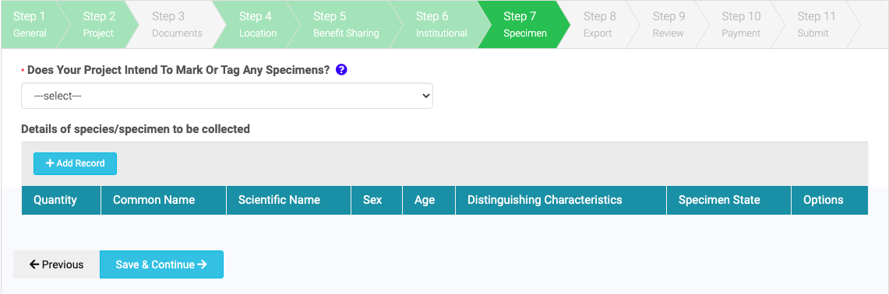
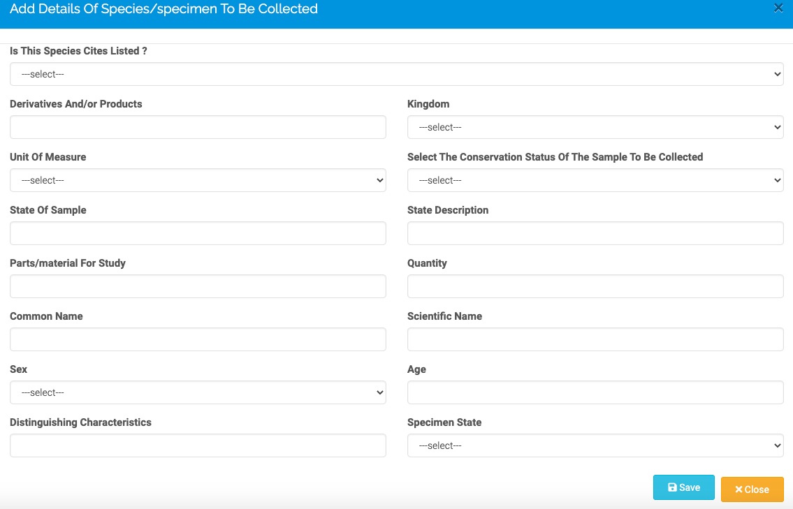

# Specimens

In this section, the applicant provides detail of species will be collected during their research project and go into more detail about what specifically they intend to collect. They will also specify whether they will be tagging specimens, and if so, the method of tagging.

The page appears like so. To add details of a species or specimen to be collected click 'Add Record' in blue. A new window will appear, through which you can add detailed information about specimens to be collected. Through this window you can specify the specimen quantity, common and scientific name, sex, age, distinguishing characteristics and specimen state. Specimen information must be added one record at a time. A summary of the record will appear in the portal once the record has been successfully saved.

For the question on the sex of a specimen please use NA if the organism does not have a sex (e.g. in the case of fungi or bacteria) or if specimens are hermaphrodites.

