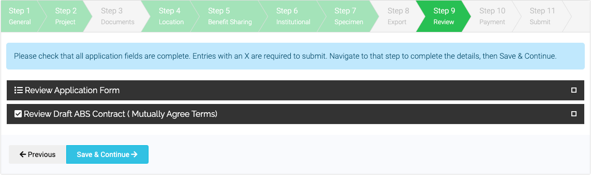

# Review

In the review stage you can review your answers for Steps 1-8 and a draft ABS Contract (also known as Mutually Agreed Terms). You can also download your pre-filled submission in the form of a pdf.

