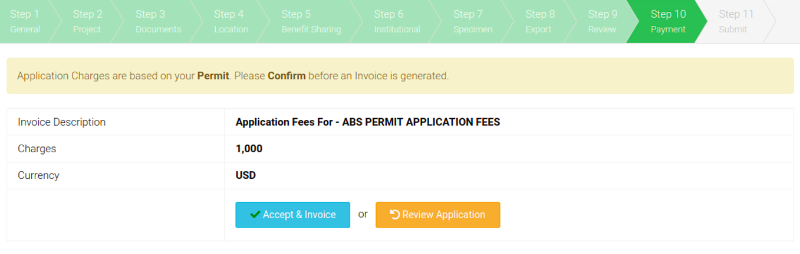
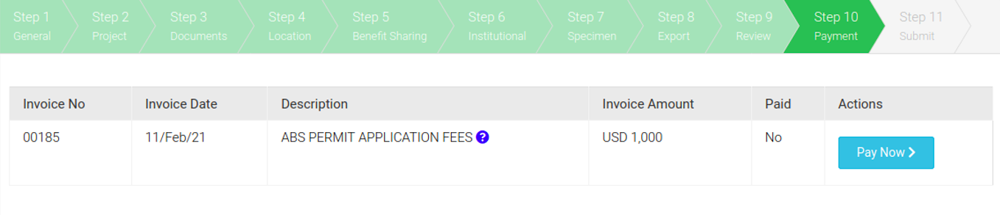

# Payment

There is an annual fee of $1,500 US per institution to use the The Bahamas Research and Access and Benefit-Sharing Permit System. This is a registration fee and not an application fee. Almost every permit the applicant requires will also have an attendant permit fee. You will receive emails notifying you of any application fees which need to be paid. You can also view all invoices in the 'Invoices' section of your home page.

You can pay the registration fee through the system.  By clicking 'Accept and Invoice' you will be shown the amount to be invoiced. Clicking 'Pay Now' you can pay via Bank Transfer, Credit Card, Paypal. If you have already paid, there is a facility to attach a pdf of evidence of payment (such as a bank deposit slip or credit card payment information)

