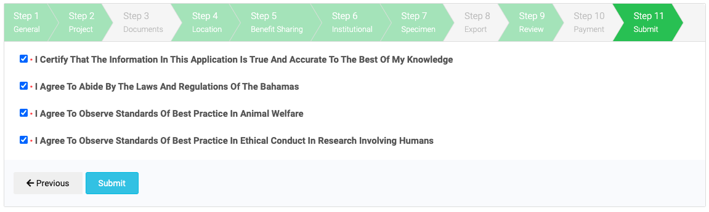

# Step 11: Submit

In this stage you submit your application. Before submission applicants must agree to what is essentially the Terms and Conditions of the application process in the Bahamas. Applicants must:

- Certify that the information in their application is true accurate to the best of their knowledge
- Agree to abide by the laws and regulations of the Bahamas
- Agree to observe standards of best practice in animal welfare
- Agree to observe standards of best practice in ethical conduct in research involving humans

The application cannot be submitted unless all four boxes have been checked.

When you are satisfied with your submission answers you are ready to submit your application. It is best to carefully examine application answers before submitting as it may not be possible to rectify mistakes later.

## What Happens Next

Following the submission of your application you and your legal officer will recieve confirmation emails. The legal officer will receive a copy of the application form and the draft contract for non-commercial research. 

In the course of reviewing your application the relevant permit granting authorities will contact you through the system to seek clarification. You will also be notified when a permit granting authority has completed processing of the application. Permits that have been processed are placed in a holding area and will not be issued to you until all other permit and contract requirements have been met. 

Permits will _only be issued_ when the contract has been signed and received by DEPP. It is therefore in your interest to contact your legal officer as soon as possible to start moving through the process towards signature. 

The collection of permits and the contract form a single _Permit and Contract_ with a shared identifier. You should print copies of these documents to bring with you and hold electronic copies. QR (quick response codes) are included to allow the relevant authorities to scan the documents. Members of your research team should also hold copies of these documents. 

Prior to departure from the Bahamas please note that if exporting materials you will be required to present the materials for phytosanitary or other sanitary inspection. Please make arrangements for these inspections in good time as they cannot be done remotely. Please contact [BAHFSA](https://www.bahamas.gov.bs/wps/portal/public/gov/government/services/!ut/p/b1/vZfZkqpIEIafpR_ANtnhkl22kqKKRW4MadxQREVFefqhZ3rixJkzp_tieiSviMiMj_wr_6pinI-zcX5Y3LbrxWXbHBb79_dcnHNgB6rKy4EtgAhOHPpqKE1YGTHjdJzRWPL1JujM8JFkxsNe-DSd3Np8uT0UZVLSekdItDyvkBARfR32M9uwqV3ojntt89P9NJnXdoDX1ik9ZlM1PulHIdyTw8XY7jOlADVppe6hEHaycZPNVTXhZONdtWF10_NmjA9s7RAttdLtimajYkt9COdFEi4L38AU7S78MsR9Otvla91PdmiVcTQL7H1TS6G9JuxydJxJ7H03Dz3hlhFDO-CXl6Hx2dA4_OZR4U9dsAaY-AqngijI4FCRj-yQAxXzH_WfJHxWb31VD8x_q7f4r9c1_yxlysNHwmcSffqR7z18peJsSJB-myDyYzrOgJ-T6nF0-l0fVT3ugx0ToEpzIWZ8REOMqIVo6SJSxQB9DEEs95SaPa0SFFxWYZlEsaYaHOvsl18BxScDsfDsDrknAwN4NpB9NvDZaxhITwaa3-9Dd5xvi_q1e6tf4VURJQ4kgWEEUeYFYZwMKFzJXeORuourBCOyvvnKyqfBOSGyFCY0bR4B53rMjPH0yqOMyRBz1xLyOPrmJkFxNe0fF7cnt6jqnN7bncFhMFqFXMkfYcOfGruOddHT5eQxccGY-1DinvSwzxIVq75hJeL7KYEmTf2VOsq_bBqRE9C4RzE8mCIFZITZoI6PLjoTGDEDfgyUxncKLUNjwbtcjA91tFsXO_lXQOnJwJB_NpB5NvDZkgrfL-lPlmJZWRCAB1mUWU7hJW6cuDO46_xwjTOL-XYtcsuq5ExxQjA-5RfnunPPWHvrDvXCJ_Nba0250VTh34LoKJXOTVU1Ie8KZU6ROZhf2pdTPDF9rd00kLmmLmHTaq96dUdsF1nN1ZofpOtIy1CNioXNJtJyk8SaMtLovlc64S2Z-6fSbb06pQGk2YS5r8oVGH05mZ3VwXh_qffjckITGBwMakQYDHL066ECd0TgEiCzYWEHEEhGPKgXECVByJgBAyxLDOShKh42pOAeXCZ_qyeL_lr8J3DKUmUA6ozoxQIQEP5voC1Mh_mIJRqqAgugc08Gku-X9KeB5GRGYRUYbCCKjMLL44TGnK-3wfr9t6J_sypekCQ33d3yNEyjvZaVwaGSHu1-HwxXUm1TSzZendiTYPeEl-btTKiwSPAitCZBn3pNq21KAudph0mZTxcXZdWmm7LyZnd_dOVso8kMxEXU0nmpse4c00gnI0Hz4z5GOdWi876xovDN6pjRVHPs4h7zHnKShS7jaVYIudsewnO0Um620muy6pS5NVu_jI_1zfM8X4zMFfo1-MXoRxR99hHDgP8BZp5Rpg!!/dl4/d5/L2dBISEvZ0FBIS9nQSEh/) for more details on inspection and certificates.